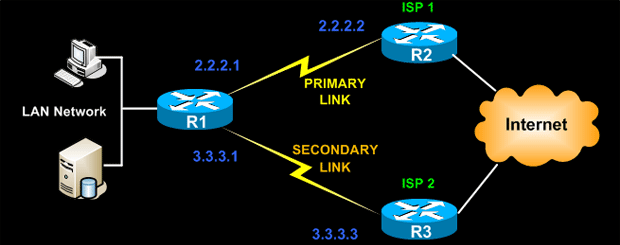

En el entorno de red actual, la redundancia es uno de los aspectos más importantes, ya sea en el lado LAN o en el lado WAN. En este tema cubriremos la redundancia WAN con múltiples enlaces WAN que terminan en un solo enrutador.

La mejor y más simple forma de lograr la redundancia de WAN en los dispositivos Cisco es utilizar rutas de respaldo estáticas confiables con seguimiento IP SLA .


En la figura anterior, el dispositivo Cisco está conectado a dos enlaces WAN ISP1 e ISP2. La configuración más común que usamos en la vida cotidiana es tener rutas predeterminadas configuradas en el enrutador Cisco que apuntan a las direcciones IP del siguiente salto, como se muestra a continuación:
 ```
R1 (config) # ip route 0.0.0.0 0.0.0.0 2.2.2.2
R1 (config) # ip route 0.0.0.0 0.0.0.0 3.3.3.3 10
 ```

 IP SLA está configurado para hacer ping a un objetivo, como una dirección IP públicamente enrutable o un objetivo dentro de la red corporativa o su IP de siguiente salto en el enrutador del ISP. Los pings se enrutan solo desde la interfaz principal. Después de una configuración de muestra de IP SLA para generar ping icmp dirigido a la IP de siguiente salto del ISP1.
 ```
 R1 (config) # ip sla 1
R1 (config) # icmp-echo 2.2.2.2 interface FastEthernet0 / 0
R1 (config) # timeout 1000
R1 (config) # umbral 2
R1 (config) # frecuency 3
 ```