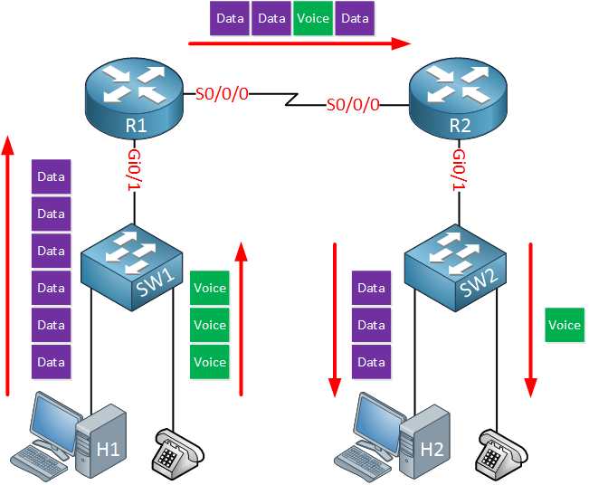

# Introducción a QoS (calidad de servicio)

Los dispositivos de red realmente no se preocupan por el tipo de tráfico que tienen que reenviar. Su conmutador recibe una trama Ethernet, busca la dirección MAC de destino y reenvía la trama hacia el destino. Lo mismo se aplica a su enrutador, recibe un paquete IP, busca el destino en la tabla de enrutamiento y reenvía el paquete hacia el destino.

¿El cuadro o paquete contiene datos de un usuario que descarga las últimas canciones de Spotify o es importante el tráfico de voz desde un teléfono VoIP? Al conmutador o enrutador realmente no le importa.

Esta lógica de reenvío se denomina mejor esfuerzo o FIFO (Primero en entrar, primero en salir) . A veces, esto puede ser un problema. Aquí hay un ejemplo rápido:



Arriba vemos una pequeña red con dos enrutadores, dos conmutadores, dos dispositivos host y dos teléfonos IP. Usamos Gigabit Ethernet en todas partes excepto entre los dos enrutadores; Este es un enlace serial lento de, digamos 1.54 Mbps.

Cuando el host y el teléfono IP transmiten datos y paquetes de voz destinados al host y al teléfono IP en el otro lado, es probable que tengamos congestión en el enlace serie. El enrutador pondrá en cola los paquetes que esperan ser transmitidos pero la cola no es ilimitada. ¿Qué debe hacer el enrutador cuando la cola está llena? soltar los paquetes de datos? los paquetes de voz? Cuando descarta paquetes de voz, el usuario del otro lado se quejará de la mala calidad de voz. Cuando descarta paquetes de datos, un usuario puede quejarse de que las velocidades de transferencia son deficientes.

## Características del tráfico de red.
Hay cuatro características del tráfico de red que debemos tratar:

- Banda ancha
- Retrasar
- Estar nervioso
- Pérdida

El ancho de banda es la velocidad del enlace, en bits por segundo (bps). Con QoS, podemos decirle al enrutador cómo usar este ancho de banda. Con FIFO, los paquetes se sirven por orden de llegada. Una de las cosas que podemos hacer con QoS es crear diferentes colas y colocar ciertos tipos de tráfico en diferentes colas. Luego podemos configurar el enrutador para que la cola uno obtenga el 50% del ancho de banda, la cola dos obtenga el 20% del ancho de banda y la cola tres obtenga el 30% restante del ancho de banda.
jemplos
Ejemplo de último paquete registrado

Este ejemplo muestra cómo mostrar información sobre el último paquete registrado:

```
Router # show mls qos last
```

Este ejemplo muestra cómo mostrar información de QoS:
```
Router# show mls qos

QoS is enabled globally
Microflow policing is enabled globally
QoS ip packet dscp rewrite enabled globally

QoS is disabled on the following interfaces:
Fa6/3 Fa6/4

QoS DSCP-mutation map is enabled on the following interfaces:
Fa6/5
Vlan or Portchannel(Multi-Earl) policies supported: Yes
Egress policies supported: Yes

----- Module [5] -----
QoS global counters:
Total packets: 164
IP shortcut packets: 0
Packets dropped by policing: 0
IP packets with TOS changed by policing: 0
IP packets with COS changed by policing: 0
Non-IP packets with COS changed by policing: 0
MPLS packets with EXP changed by policing: 0
 ```