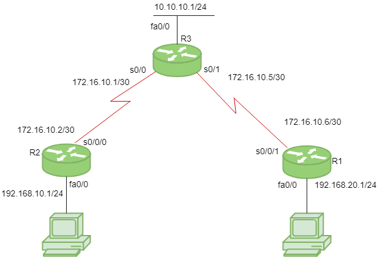

# Protocolo de información de enrutamiento (RIP)

El Protocolo de información de enrutamiento (RIP) es un protocolo de enrutamiento dinámico que utiliza el conteo de saltos como una métrica de enrutamiento para encontrar la mejor ruta entre la red de origen y la de destino. Es un protocolo de enrutamiento de vector de distancia que tiene un valor AD 120 y funciona en la capa de aplicación del modelo OSI. RIP usa el número de puerto 520.

## Características de RIP:


1. Las actualizaciones de la red se intercambian periódicamente.
2. Las actualizaciones (información de enrutamiento) siempre se transmiten.
3. Las tablas de enrutamiento completas se envían en actualizaciones.
4. Los enrutadores siempre confían en la información de enrutamiento recibida de los enrutadores vecinos. Esto también se conoce como enrutamiento en rumores .

## Versiones de RIP

RIP v1 se conoce como Classful Routing Protocol porque no envía información de la máscara de subred en su actualización de enrutamiento.

RIP v2 se conoce como protocolo de enrutamiento sin clase porque envía información de la máscara de subred en su actualización de enrutamiento.



considere la topología dada anteriormente que tiene 3 enrutadores R1, R2, R3. R1 tiene la dirección IP 172.16.10.6/30 en s0 / 0/1, 192.168.20.1/24 en fa0 / 0. R2 tiene la dirección IP 172.16.10.2/30 en s0 / 0/0, 192.168.10.1/24 en fa0 / 0. R3 tiene la dirección IP 172.16.10.5/30 en s0 / 1, 172.16.10.1/30 en s0 / 0, 10.10.10.1/24 en fa0 / 0.

Configure RIP para R1:

```
R1(config)# router rip
R1(config-router)# network 192.168.20.0
R1(config-router)# network 172.16.10.4
R1(config-router)# version 2
R1(config-router)# no auto-summary
```
Configure RIP para R2:
```
R2(config)# router rip
R2(config-router)# network 192.168.10.0
R2(config-router)# network 172.16.10.0
R2(config-router)# version 2
R2(config-router)# no auto-summary
```
De forma similar, Configure RIP para R3 :
```
R3(config)# router rip
R3(config-router)# network 10.10.10.0
R3(config-router)# network 172.16.10.4
R3(config-router)# network 172.16.10.0
R3(config-router)# version 2
R3(config-router)# no auto-summary
 ```